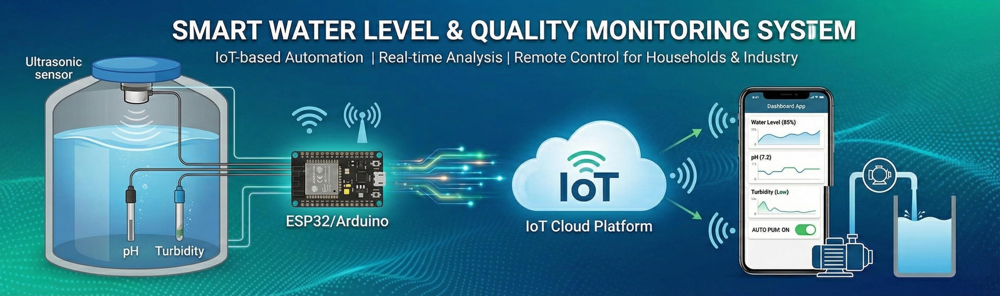

<!-- Repository Banner -->

  

---

## 🔹 Overview  

This system automates the monitoring of water tanks by collecting data from multiple sensors and displaying it through a web dashboard. It alerts the user when the tank is too low or full, and automatically controls the pump based on predefined thresholds. In addition to level detection, the system evaluates water quality using pH and turbidity measurements.
>See the demo video below for a quick visual explanation of how the system works.

  

 
>Full system description referenced from project documentation.

---

## 🔹 Objectives  

- Enable real-time remote monitoring of water level and water quality  
- Reduce water wastage by automating pump operations  
- Prevent pump dry-running and overflow  
- Provide user-friendly alerts and control options  
- Support domestic and small-scale industrial water systems  

---

## 🔹 System Architecture  

### **Core Modules**
- **Water Level Module:** Ultrasonic sensor + controller unit  
- **Water Quality Module:** pH and turbidity sensors  
- **Communication Module:** Wi-Fi (NodeMCU) and optional GSM alerts  
- **Control Module:** Automatic pump control + manual override  
- **Visualization Module:** Web/mobile dashboard for live data  

### **How It Works**
1. Water level and quality sensors collect data continuously  
2. Microcontrollers process the measurements  
3. Data is transmitted to a cloud dashboard  
4. Tank status and water quality values are displayed in real time  
5. Alerts are issued for high/low water levels or poor water quality  
6. Pump is automatically switched on/off based on level thresholds  

---

## 🔹 Hardware Components  

- Arduino Uno / Arduino Nano  
- NodeMCU ESP8266  
- Ultrasonic Sensor (HC-SR04)  
- pH Sensor  
- Turbidity Sensor  
- GSM Module (optional)  
- LCD Display (16×2, I2C)  
- Buzzer, LEDs, buttons  
- LM2596 Buck Converter  
- Power supply: 5V regulated  

---

## 📁 Suggested Repository Structure  
---

## 📁 Suggested Repository Structure
